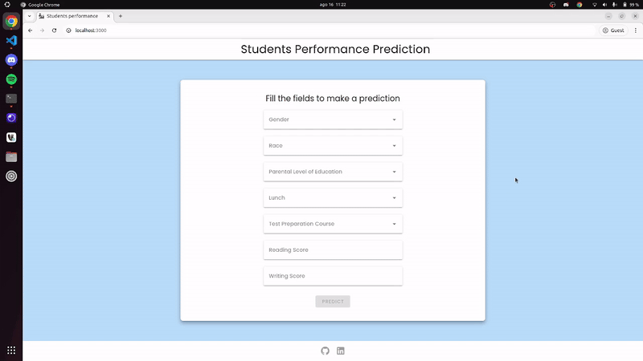

<h1>Students Performance</h1>

<p>The goal of this project is to predict a student s math score based on his attributes. The dataset was taken from Kaggle. You can access  it clicking <a href="https://www.kaggle.com/datasets/spscientist/students-performance-in-exams">here</a>.</p>



<h2>Technologies</h2>
<div>


</div>

<h2>Setup</h2>

<strong>Node</strong> is required to run this application. You can install it <a href="https://nodejs.org/en">here</a>.

With Node already installed, go to the folder `frontend` in the terminal and run the following command:

```bash
npm install
```

This command will get all the vue, vite and vuetify dependecies automatically.

Then, you're ready to start the vuetify setup, just run:

```bash
npm run dev
```

To run the algorithm and the database, first you will need to install the <a href="https://www.python.org/">Python Interpreter</a>.

With Python installed, it's needed to create a virtual environment to isolate all the dependencies in the project folder. To make it easer, just run in the project root directory:

**Linux**

```bash
python3 -m venv venv
```

To activate the virtual env, run:

```bash
source venv/bin/activate
```

**Windows**

```bash
python -m venv venv
```

To activate the virtual env, run:

`cmd`

```bash
.\venv\Scripts\activate.bat
```

`PowerShell`

```bash
.\venv\Scripts\activate.ps1
```

**Running SQL Database**

Django detects the changes in the models by running the following command:

```bash
python manage.py makemigrations
```

To effectively build the database tables, run:

```bash
python manage.py migrate
```

Then, you're ready to run the Django project:

```bash
python manage.py runserver
```
